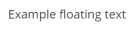
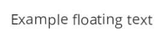

# floating_text

Very little library for make text floating.

GIFs are better than words :







These samples are not stylised, but you can do what you want of course.

Check the SCSS file for edit the floating comportment.

**require JQuery !**

## How to use

First you have to include in your HTML the following files:

In the `head`
```html
<link rel="stylesheet" href="../css/floating_text.css"/>
```
or
```html
<link rel="stylesheet" href="../css/floating_text.min.css"/>
```

At the end of `body`
```html
<script src="../js/floating_text.js"></script>
```

Don't forget to include JQuery **before** this library !
Example:
```html
<script src="https://code.jquery.com/jquery-2.2.4.min.js"></script>
```

Then, when the page is loaded, you have to launch a javascript function:
```javascript
	FLOATING_TEXT.float(); //(it will work for body and his children)
```
or
```javascript
	FLOATING_TEXT.float($('your_element')); //(it will work for your_element and his children)
```

Your text elements have to use the class `floating_text` when you launch the function.
Then you can add and remove the class `run-animation` when you want to control the running state.

Check the example !
